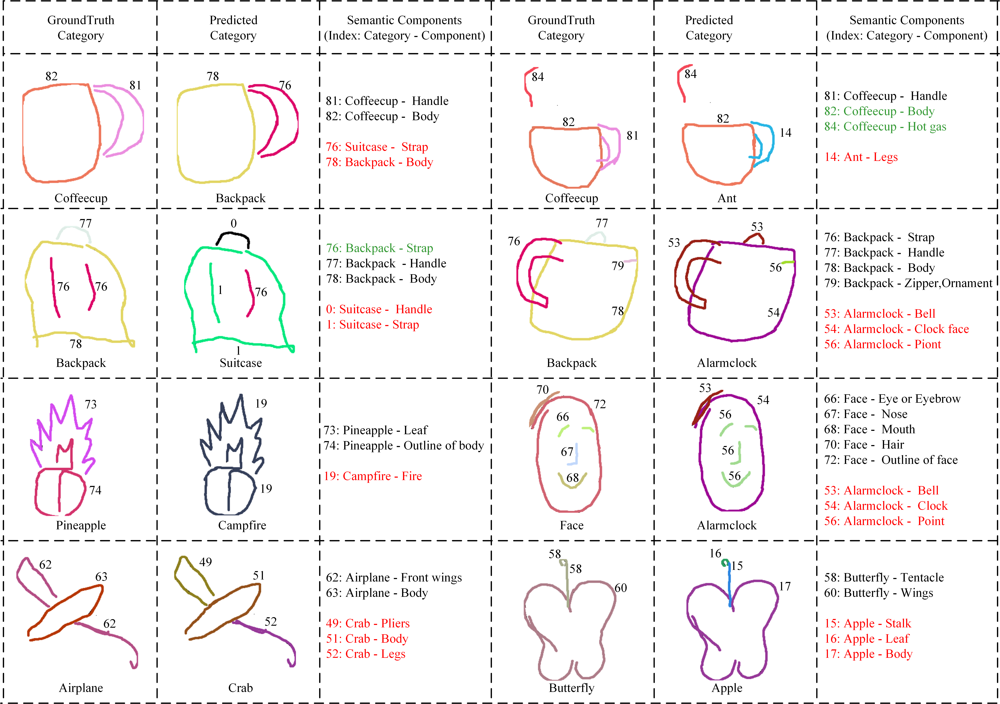

# SketchESC
Free-hand sketches are appealing for humans as a universal tool to depict the visual world. Humans can recognize varied sketches of a category easily by identifying the concurrence and layout of the intrinsic semantic components of the category, since humans draw free-hand sketches based a common consensus that which types of semantic components constitute each sketch category. For example, an airplane should at least have a fuselage and wings. Based on this analysis, a semantic component-level memory module is constructed and embedded in the proposed structured sketch recognition network in this paper. The memory keys representing semantic components of each sketch category can be self-learned and enhance the recognition network’s explainability. Our proposed networks can deal with different situations of sketch recognition, i.e., with or without semantic components labels of strokes. Experiments on the SPG and SketchIME datasets demonstrate the memory module’s flexibility and the recognition network’s explainability.

## Architecture of the proposed network
Overview of the proposed Structured Sketch Recognition network. The &#9312; indicates the scenario that the Semantic Component-Level Memory module feeds the fused stroke-level features into Transformer for sketch recognition and segmentation. The  &#9313; indicates the scenario that the fused component-level features are fed into Transformer for sketch recognition and the probability prediction on the existence of each type of semantic component.


## Visualizations
Visualization of semantic component features using t-SNE and some sketch samples.  The (a) shows the feature visualization of the 87 types of semantic components in SPG.  The (b) shows some sketch examples whose parts of semantic components are indistinguishable in the feature space, but our SSR network can do recognition and segmentation correctly.


 
Examples of wrongly-recognized sketches in the SPG dataset. The numbers around the strokes are the groundtruth or predicted type indexes of semantic components.


More examples of wrongly-recognized sketches in the SPG dataset. The numbers around the strokes are the groundtruth or predicted type indexes of semantic components. The green, red, black fonts mean that the related semantic compo-nents are correctly-recognized, wrongly-recognized, not recognized, respectively.



Examples of wrongly-recognized sketches in the SketchIME dataset. The numbers around the strokes are the ground-truth or predicted type indexes of semantic components. Different types of semantic components are also drawn with different colored lines. The “C**” under each sketch sample denotes the category label. The sketches in the SketchIME dataset are not familiar everyday objects, and their semantic components are abstract. Therefore, the far right column displays the examples of free-hand strokes of each semantic component.


Examples of the recognition and derived semantic segmentation results in the SPG dataset when training only with the category labels and the prior knowledge about which types of semantic components constitute each sketch category (without the semantic component labels of strokes).  The numbers around the strokes are the groundtruth or predicted type indexes of semantic components. The green, red, black fonts mean that the related semantic components are cor-rectly-recognized, wrongly-recognized, not recognized, respectively.


## Instructions

### Dependencies

torch 1.12.0

torch-geometric 1.6.0

### Dateset

[download](https://drive.google.com/file/d/1R2zOrv5hIv2GOsEwTCZBHLfXcum9j9Ua/view?usp=sharing) SPG dataset to data dir

[download](https://drive.google.com/file/d/1TbaK46IQvI6MCs0JpCcB1Fcx8Nr3i8g8/view?usp=sharing) SketchIME dataset to data dir

[download](https://drive.google.com/file/d/1Mx3zRbZCTDyAUg7S8HSel1v0qJHjRvAX/view?usp=sharing) pretrained transformer model to pretrained_model dir

### Run

``` python main.py ```

